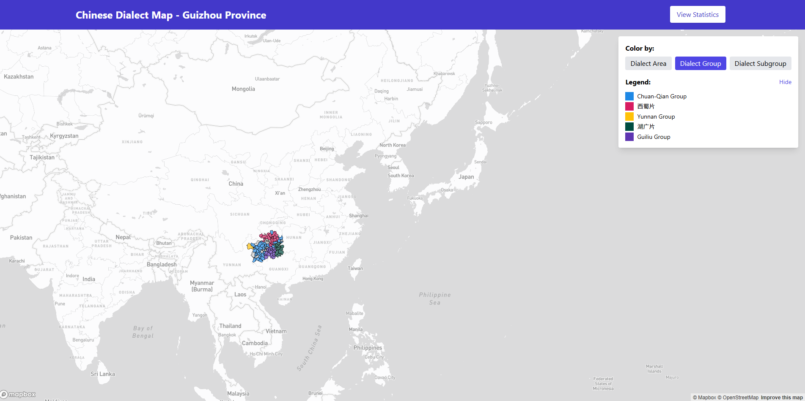
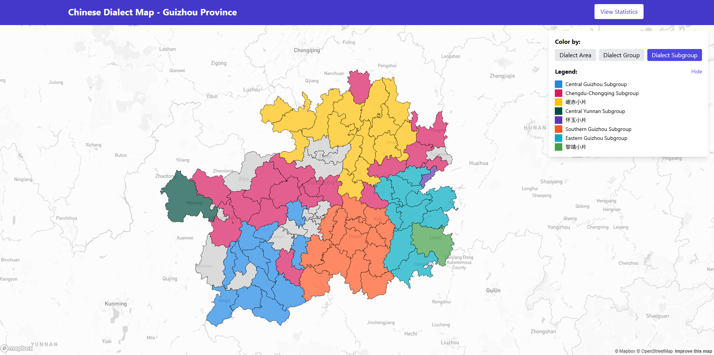

# Chinese Dialect Visualization Project

## Overview

This project aims to create an interactive web visualization of Chinese dialects using Mapbox, GeoJSON, and linguistic data. Inspired by projects like [the First Peoples' Language Map of British Columbia](https://maps.fpcc.ca/languages), our goal is to develop a modern web application (using Next.js) that allows users to explore the rich diversity of Chinese dialects across different regions.

## Data Sources

### Linguistic Data
Our linguistic data is sourced from the authoritative "Atlas of Chinese Languages" (second edition, Chinese Dialect Volume):

```
@book{中国社会科学院2012中国语言地图集,
  title={中国语言地图集: 第2版. 汉语方言卷},
  author={中国社会科学院. 民族学与人类学研究所 and City University of Hong Kong. 语言资讯科学研究中心 and 香港城市大学. 语言资讯科学研究中心},
  isbn={9787100070546},
  url={https://books.google.ca/books?id=qRMEnwEACAAJ},
  year={2012},
  publisher={商務印書馆}
}
```

This dataset provides comprehensive information about dialect regions, groups, and sub-groups across China at the county level.

### Geographic Data
The GeoJSON data containing administrative boundaries is from Map World (天地图), which is:
- Hosted by: Ministry of Natural Resources of the People's Republic of China (中华人民共和国自然资源部)
- Operated by: National Geomatics Center of China (国家基础地理信息中心)
- Source: [https://www.tianditu.gov.cn/](https://www.tianditu.gov.cn/)

## Current Progress

### Data Processing
We've implemented several Python scripts to process and prepare the data for visualization:

1. **GeoJSON Data Extraction**: Due to the large size of the original GeoJSON file, we've created scripts to extract region-specific data (currently focusing on Guizhou province for demonstration purposes).

2. **Linguistic Data Processing**: We've extracted and processed the linguistic data corresponding to Guizhou province, ensuring compatibility with the GeoJSON format.

3. **Data Alignment**: We've addressed key technical challenges including:
   - Matching county-level codes between datasets
   - Modifying county codes in the linguistic data by adding ".0" suffix to match the format used in the GeoJSON data
   - Creating a unified dataset that preserves both geographic boundaries and linguistic information

### Demo Implementation
The current demo extracts Guizhou province data using regex pattern matching in both datasets. The Python scripts handle:
- Extraction of geographic features from the large GeoJSON file
- Filtering linguistic data for Guizhou province
- Transforming county codes to ensure proper joining between datasets

## Web Application Structure

The application is built using Next.js with TypeScript and follows this structure:

- **Pages**
  - `index.tsx`: Main map visualization with interactive controls
  - `stats.tsx`: Statistical analysis of dialect distributions
  - `check-env.tsx`: Environment checker for debugging data issues
  
- **API Routes**
  - `/api/geojson.ts`: Serves the geographic data
  - `/api/lingdata.ts`: Serves the linguistic dialect data
  - `/api/dialectstats.ts`: Provides statistical summaries
  - `/api/check-data-consistency.ts`: Checks data integrity between datasets
  
- **Components**
  - `CountyPopup.tsx`: Displays detailed information when clicking on a county

- **Key Features**
  - Interactive map visualization with Mapbox GL
  - Three categorization levels (Dialect Area, Group, Subgroup)
  - Color-coded counties with dynamic legend
  - Detailed dialect information on click
  - Statistical analysis page

## Visualizations

### Dialect Groups


### Dialect Subgroups


## Running the Application

### Prerequisites
- Node.js (v14 or later)
- npm or yarn
- Mapbox API token

### Development Setup
1. Clone the repository
2. Navigate to the project directory
3. Install dependencies:
   ```
   npm install
   ```
4. Create a `.env.local` file with your Mapbox token:
   ```
   NEXT_PUBLIC_MAPBOX_TOKEN=your_mapbox_token_here
   ```
5. Start the development server:
   ```
   npm run dev
   ```
6. Open [http://localhost:3000](http://localhost:3000) in your browser

### Production Build
```
npm run build
npm start
```

## Docker Deployment

### Prerequisites
- Docker and Docker Compose
- Mapbox API token

### Docker Setup
1. Create a `.env` file in the project root:
   ```
   NEXT_PUBLIC_MAPBOX_TOKEN=your_mapbox_token_here
   ```
2. Build and run the container:
   ```
   # On Windows
   .\docker-build.bat
   
   # On Unix/Linux/macOS
   chmod +x docker-build.sh
   ./docker-build.sh
   ```
3. Access the application at [http://localhost:3000](http://localhost:3000)

### Stopping the Container
```
docker-compose down
```

## Repository Structure

```
mapbox-ling-cn/
├── data/processed
│   ├── guizhou_counties.geojson          # Extracted Guizhou geographic data
│   └── guizhou_ling_data.json            # Extracted Guizhou linguistic data
├── requirements.txt                      # Project dependencies
└── README.md                             # This file
```

## Getting Started

1. Clone this repository
2. Install dependencies: `pip install -r requirements.txt`

## Future Vision

The completed project will serve as an interactive educational tool for exploring and understanding the rich diversity of Chinese dialects. It will provide a visually engaging way to explore linguistic boundaries and their relationship to geographic and administrative regions across China. 
